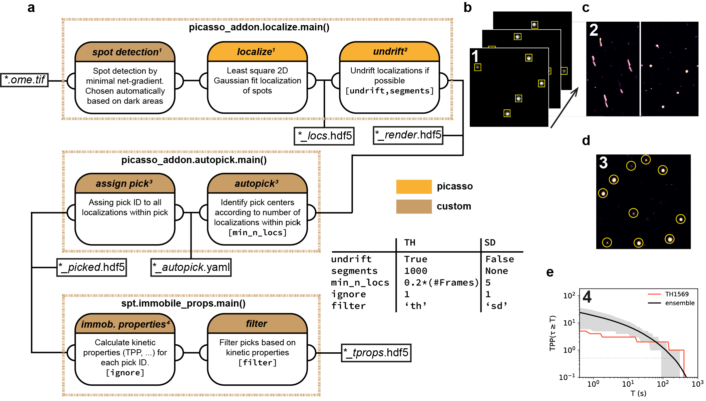

.. _picasso_addon:
	https://github.com/schwille-paint/picasso_addon
.. _picasso:
	https://github.com/jungmannlab/picasso
.. _picasso.localize:
	https://picassosr.readthedocs.io/en/latest/localize.html
.. _trackpy:
	http://soft-matter.github.io/trackpy/v0.4.2/

SPT: Single particle tracking analysis
======================================

This package provides a complete single particle tracking analysis workflow based on `picasso_addon`_, `picasso`_ and `trackpy`_ python packages including:

- Localization of raw movies based on `picasso_addon`_ (auto net-gradient) and `picasso.localize`_
- Autopicking of localization clusters (`picasso_addon`_) and analysis of immobilized particles
- Linking of localizations into trajectories using `trackpy`_
- Individual mean-square-displacement computation and linear iterative fitting
- Subtrajectory analysis for estimation of underlying diffusion behavior
- Easy to use script batch processing

SPT requires the following packages:
    - `picasso`_  :  Localization and rendering of super-reolution images
    - `picasso_addon`_ : Further functionalities for picasso (auto net-gradient, autopick)

Please refer to the `readthedocs <https://spt.readthedocs.io/en/latest/index.html#>`_ for further information.

SPT was used for data analysis in:

- `Tracking Single Particles for Hours via Continuous DNA-mediated Fluorophore Exchange <https://www.biorxiv.org/content/10.1101/2020.05.17.100354v1>`_

Installation
============

Create conda environment   
^^^^^^^^^^^^^^^^^^^^^^^^
Since the SPT package is based on the `picasso_addon`_ package, please follow the instructions 
`how to set up a conda environment for picasso_addon <https://picasso-addon.readthedocs.io/en/latest/installation.html>`_. The thus created environment (``picasso_addon``) provides all
necessary dependencies for SPT.

Download and use SPT
^^^^^^^^^^^^^^^^^^^^
To use the SPT package please clone the SPT GitHub repository. 
You can add the package to your environment (e.g. ``picasso_addon``) by switching to the downloaded folder (SPT) and typing

.. code-block:: console

    (picasso_addon) python setup.py install

 
If you don't want to install the SPT package into your environment but want to be able to permanently import SPT functions in any IPython (Spyder, Jupyter) session do the following:
    1. Navigate to ~/.ipython/profile_default
    2. Create a folder called startup if it’s not already there
    3. Add a new Python file called ``start.py`` or modify it and add 
    
    .. code-block:: python

        import sys
        sys.path.append('C:/yourpath/SPT')